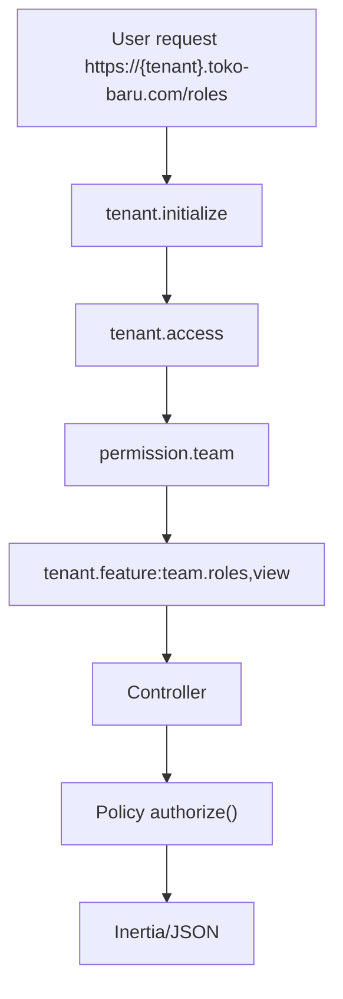

# 03 Features - RBAC

## 1) Tujuan dan Ruang Lingkup

RBAC di project ini memastikan akses per-tenant dengan kombinasi:

- Spatie role/permission (`teams=true`)
- Tenant permission context (`tenant_id`)
- Policy authorization + fallback role_code legacy
- Route middleware guard untuk web dan api

## 2) Diagram Alur Request

## 3) Mapping UI -> Route -> Middleware -> Controller/Policy/Service

| UI | Route | Middleware Kunci | Backend |
|---|---|---|---|
| Roles page | `GET https://{tenant}.toko-baru.com/roles` | `tenant.initialize`, `tenant.access`, `permission.team`, `tenant.feature:team.roles,view` | `TenantWorkspaceController::roles` |
| Roles API list | `GET /api/v1/tenants/{tenant}/roles` | sama + `auth:sanctum` | `TenantRoleApiController::index`, `TenantRolePolicy::viewAny` |
| Update role permissions | `PATCH /api/v1/tenants/{tenant}/roles/{role}/permissions` | `tenant.feature:team.roles,assign` | `TenantRoleApiController::updatePermissions`, `TenantRolePolicy::assignPermissions` |

Referensi implementasi:

- `config/permission.php` (`teams=true`, `team_foreign_key=tenant_id`)
- `config/permission_modules.php`
- `app/Support/PermissionCatalog.php`
- `app/Http/Middleware/SetPermissionTeamContext.php`
- `app/Policies/TenantRolePolicy.php`
- `app/Policies/TenantMemberPolicy.php`
- `app/Providers/AuthServiceProvider.php`

## 4) Struktur Data/Konfigurasi

- Permission matrix dibangun dari `config/permission_modules.php`.
- Catalog `PermissionCatalog::matrixPermissions()` menghasilkan format `module.action` (contoh `team.roles.view`).
- Role assignment terscope tenant lewat Spatie team context.

## 5) Error / Edge Cases

- `403 Forbidden` ketika permission tidak sesuai policy.
- `422 IMMUTABLE_SYSTEM_ROLE` saat edit/hapus role sistem.
- `409 VERSION_CONFLICT` saat OCC `row_version` mismatch.

## 6) Cara Extend Aman

Do:

- Tambah module-action baru di `config/permission_modules.php`.
- Sinkronkan policy dan middleware `tenant.feature`.
- Tambah test feature untuk role policy + API guard.

Don't:

- Jangan bypass `permission.team` pada route tenant.
- Jangan hardcode role string di banyak tempat tanpa policy/permission check.

## Screenshot

## Test Coverage Terkait

- `tests/Feature/TenantMemberApiTest.php`
- `tests/Feature/SuperadminControlPlaneTest.php`
- `tests/Feature/TenantSelectorAccessTest.php`
