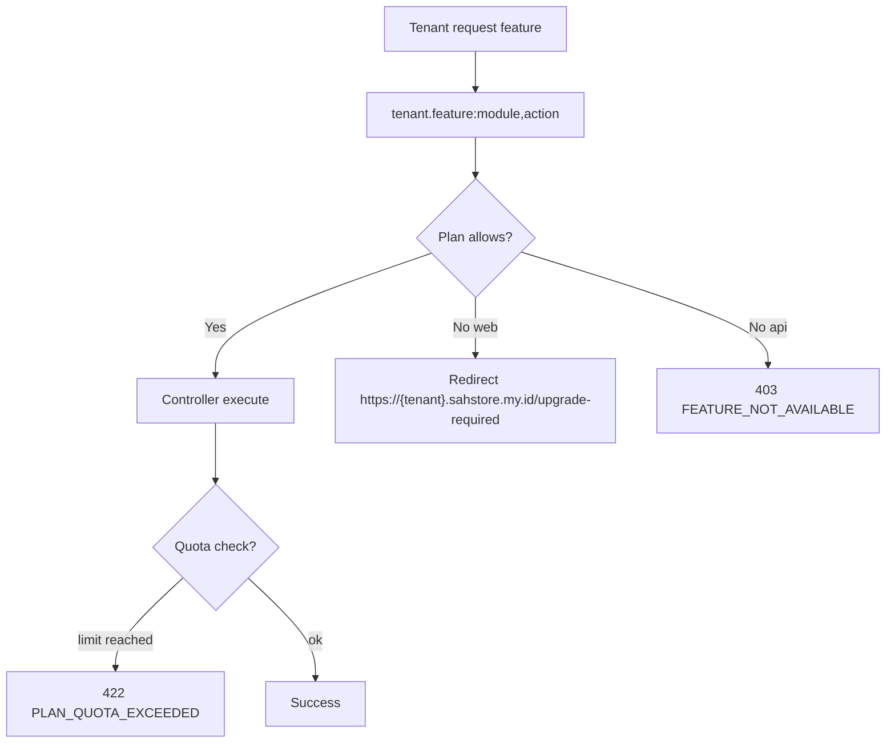

# 03 Features - Subscription

## 1) Tujuan dan Ruang Lingkup

Subscription mengatur:

- Feature access per plan (`free`, `pro`, `business`, `enterprise`)
- Quota limit per plan (members, custom roles, pending invitations)
- Guard di route-level dan controller-level

## 2) Diagram Alur Request

## 3) Mapping UI -> Route -> Middleware -> Controller/Policy/Service

| UI/API | Route | Middleware | Backend |
|---|---|---|---|
| Tenant feature pages | `https://{tenant}.sahstore.my.id/*` | `tenant.feature:*` | `TenantWorkspaceController` |
| Tenant API mutation | `/api/v1/tenants/{tenant}/*` | `tenant.feature:*` + throttle | `Tenant*ApiController` |
| Admin subscription panel | `/admin/tenants/subscriptions` | `superadmin.only` | `TenantSubscriptionController` |

Referensi implementasi:

- `config/subscription_entitlements.php`
- `app/Support/SubscriptionEntitlements.php`
- `app/Http/Middleware/EnsureTenantFeatureEnabled.php`
- `app/Http/Controllers/Admin/TenantSubscriptionController.php`
- `app/Http/Middleware/HandleInertiaRequests.php`
- `database/migrations/2026_03_27_100000_create_tenants_table.php` (`plan_code`)

## 4) Struktur Data/Konfigurasi

- Plan matrix:
  - `features.<module> = [actions]`
  - `limits.<limit_key> = int`
- Tenant plan disimpan di `tenants.plan_code`.
- Frontend menerima:
  - `entitlements.modules`
  - `subscription.plan`
  - `subscription.usage`

## 5) Error / Edge Cases

- `403 FEATURE_NOT_AVAILABLE` untuk API saat plan tidak mengizinkan module/action.
- Redirect web ke `tenant.upgrade.required` untuk fitur tak tersedia.
- `422 PLAN_QUOTA_EXCEEDED` saat limit quota terlewati.
- Plan code invalid pada admin update -> `422 VALIDATION_ERROR`.

Kata kunci penting untuk troubleshooting:

- `tenant.feature`
- `plan_code`
- `PLAN_QUOTA_EXCEEDED`

## 6) Cara Extend Aman

Do:

- Tambah module baru di `subscription_entitlements.php` dan `permission_modules.php` bila perlu.
- Pasang guard `tenant.feature:<module>,<action>` di route web + api.
- Tambah/ubah limit dengan update test quota.

Don't:

- Jangan expose route tenant tanpa guard subscription untuk fitur berbayar.
- Jangan ubah kode plan di DB tanpa update config entitlements.

## Screenshot

## Test Coverage Terkait

- `tests/Feature/TenantSubscriptionAdminTest.php`
- `tests/Feature/TenantSubscriptionGuardTest.php`
- `tests/Feature/TenantSubscriptionQuotaTest.php`
