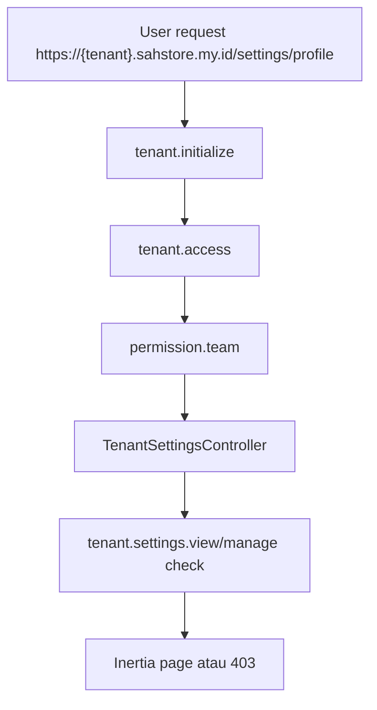

# 03 Features - Tenant Settings

## 1) Tujuan dan Ruang Lingkup

Tenant settings adalah domain pengaturan organisasi workspace, bukan pengaturan akun user.

Surface aktif:

- satu entry sidebar: `Settings`
- tab konten:
  - `Organization Profile`
  - `Branding`
  - `Localization`
  - `Billing`

Tujuan utamanya:

- memisahkan account settings user dari organisasi tenant
- menyediakan branding per tenant yang bisa dipakai shell aktif
- menjaga kontrol akses tenant settings tetap permission-based

## 2) Diagram Alur Request

## 3) Mapping UI -> Route -> Middleware -> Controller/Policy/Service

| UI | Route | Middleware Kunci | Backend |
|---|---|---|---|
| Settings landing | `GET https://{tenant}.sahstore.my.id/settings` | `tenant.initialize`, `tenant.access`, `permission.team` | redirect ke `tenant.settings.profile` |
| Organization Profile | `GET https://{tenant}.sahstore.my.id/settings/profile` | `tenant.initialize`, `tenant.access`, `permission.team` | `TenantSettingsController::profile` |
| Save Organization Profile | `PATCH https://{tenant}.sahstore.my.id/settings/profile` | sama | `TenantSettingsController::updateProfile` + `TenantProfileUpdateRequest` |
| Branding | `GET https://{tenant}.sahstore.my.id/settings/branding` | sama | `TenantSettingsController::branding` |
| Upload Branding | `POST https://{tenant}.sahstore.my.id/settings/branding` | sama | `TenantSettingsController::updateBranding` + `TenantBrandingUpdateRequest` |
| Reset Branding Slot | `DELETE https://{tenant}.sahstore.my.id/settings/branding/{slot}` | sama | `TenantSettingsController::removeBranding` |
| Localization | `GET https://{tenant}.sahstore.my.id/settings/localization` | sama | `TenantSettingsController::localization` |
| Save Localization | `PATCH https://{tenant}.sahstore.my.id/settings/localization` | sama | `TenantSettingsController::updateLocalization` + `TenantLocalizationUpdateRequest` |
| Billing | `GET https://{tenant}.sahstore.my.id/settings/billing` | sama | `TenantSettingsController::billing` |
| Save Billing | `PATCH https://{tenant}.sahstore.my.id/settings/billing` | sama | `TenantSettingsController::updateBilling` + `TenantBillingUpdateRequest` |

Referensi implementasi:

- `routes/web.php`
- `app/Http/Controllers/TenantSettingsController.php`
- `app/Http/Requests/Tenant/*`
- `app/Support/TenantBranding.php`
- `resources/js/Pages/Tenant/Settings/*`

## 4) Struktur Data dan Branding Contract

Field tenant yang dipakai feature ini mencakup:

- identity: `display_name`, `legal_name`, `registration_number`, `tax_id`
- business: `industry`, `website_url`, `support_email`, `billing_email`, `billing_contact_name`, `phone`
- address: `address_line_1`, `address_line_2`, `city`, `state_region`, `postal_code`, `country_code`
- localization: `locale`, `timezone`, `currency_code`
- branding: `logo_light_path`, `logo_dark_path`, `logo_icon_path`, `favicon_path`

Branding storage contract:

- `storage/app/public/tenants/{tenant_id}/branding/logo-light.*`
- `storage/app/public/tenants/{tenant_id}/branding/logo-dark.*`
- `storage/app/public/tenants/{tenant_id}/branding/logo-icon.*`
- `storage/app/public/tenants/{tenant_id}/branding/favicon.*`

Aturan penting:

1. Nama file slot stabil, bukan random.
2. Upload baru pada slot yang sama menghapus file lama slot tersebut.
3. Jika slot kosong, shell fallback ke asset global `appsah`.
4. Saat tenant dihapus, folder branding tenant ikut dipurge.

## 5) Access Rules dan Error / Edge Cases

Permission contract:

- `tenant.settings.view`
- `tenant.settings.manage`

Perilaku yang diharapkan:

1. Menu tenant settings tetap terlihat di sidebar tenant sebagai bagian dari information architecture workspace.
2. Sidebar hanya menampilkan satu item `Settings`; subsection internal berpindah lewat tabs di dalam halaman.
3. User tanpa permission tidak di-hide dari route level; direct access harus mendapat `403 Forbidden`.
4. State `403 Forbidden` untuk tenant settings harus mengikuti pola workspace full-page cover seperti halaman tenant lain, bukan modal datar yang terasa keluar dari shell.

Error dan edge case utama:

- `403 Forbidden` jika user tidak punya `tenant.settings.view/manage`
- `404` jika slot branding tidak valid
- `422` jika mime/size branding tidak sesuai
- fallback ke global app branding jika tenant belum upload asset

## 6) Cara Extend Aman

Do:

- Tambah field tenant baru lewat migration + request validation + `tenantPayload()`.
- Pertahankan branding upload per-slot dan per-tenant.
- Pakai permission `tenant.settings.*` untuk kontrol akses, bukan hardcode role owner.
- Pastikan shell membaca branding tenant dari shared props, bukan dari path storage mentah.

Don't:

- Jangan campur field organisasi tenant ke halaman `/profile*`.
- Jangan simpan asset branding tenant di repo.
- Jangan hide tenant settings dari sidebar hanya karena user tidak punya permission; biarkan backend yang memberi `403`.
- Jangan ubah nama slot branding menjadi random filename tanpa alasan kuat.

## 7) Screenshot Checklist

Minimum screenshot yang harus tersedia untuk fitur ini:

1. `tenant-settings-profile-happy.png`
2. `tenant-settings-branding-preview-happy.png`
3. `tenant-settings-forbidden-cover.png`

Folder target:

- `docs/assets/screenshots/tenant-settings`

## 8) Test Coverage Terkait

- `tests/Feature/TenantSettingsTest.php`
- `tests/e2e/workspace-smoke.spec.ts`
