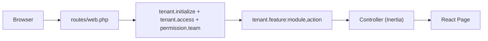
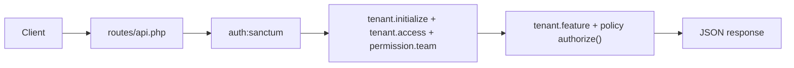

# 02 - Architecture

## Gambaran Umum

Stack utama:

- Backend: Laravel 12 + Sanctum + Stancl Tenancy + Spatie Permission
- Frontend: Inertia + React + TypeScript
- Auth: session + social auth + MFA

## Core Frontend Contract

- Core shell aktif hanya terdiri dari `Auth`, `Tenant`, `Admin`, dan `Landing`.
- Logged-in app (`Tenant`, `Admin`, dan halaman account`) memakai satu shared shell di `resources/js/app-shell/*`.
- Account user tetap berada di `/profile*`, sedangkan pengaturan organisasi tenant hidup di `https://{tenant}.toko-baru.com/settings/*`.
- Wrapper `Auth` dan `Landing` tetap terpisah, tetapi memakai visual system yang sama: token, typography, component styling, dan spacing mengikuti fondasi Velzon yang sama.
- Persistensi shell sekarang memakai satu namespace `ui_preferences.appShell` dengan kontrak layout penuh ala Velzon (`layoutType`, `layoutModeType`, `layoutWidthType`, `leftsidbarSizeType`, `leftSidebarType`, dan pasangan state shell terkait).
- Navigasi tenant/admin berasal dari satu source of truth: `resources/js/common/shellNavigation.ts`.
- Persistensi preferensi shell menggunakan endpoint `PUT /settings/theme` dengan kontrak canonical `appShell` dan mapper kompatibilitas untuk payload layout lama.

## Tenant Settings Domain

- Tenant settings production-grade sekarang dipisah menjadi empat surface:
  - `https://{tenant}.toko-baru.com/settings/profile`
  - `https://{tenant}.toko-baru.com/settings/branding`
  - `https://{tenant}.toko-baru.com/settings/localization`
  - `https://{tenant}.toko-baru.com/settings/billing`
- Access model untuk surface ini berbasis permission matrix:
  - `tenant.settings.view`
  - `tenant.settings.manage`
- Default provisioning memberi `owner` dan `admin` akses manage, sementara role `member` tidak otomatis mewarisi visibility tenant settings.
- Data tenant sekarang memuat:
  - organization identity (`display_name`, `legal_name`, `registration_number`, `tax_id`)
  - business contacts (`support_email`, `billing_email`, `billing_contact_name`, `phone`, `website_url`)
  - address and regional defaults (`address_line_*`, `city`, `state_region`, `postal_code`, `country_code`, `locale`, `timezone`, `currency_code`)
  - branding slots (`logo_light_path`, `logo_dark_path`, `logo_icon_path`, `favicon_path`)

## Tenant Branding Storage Contract

- Semua asset branding tenant di-upload ke storage publik Laravel, bukan disimpan di repo.
- Namespace storage per tenant:
  - `storage/app/public/tenants/{tenant_id}/branding/logo-light.*`
  - `storage/app/public/tenants/{tenant_id}/branding/logo-dark.*`
  - `storage/app/public/tenants/{tenant_id}/branding/logo-icon.*`
  - `storage/app/public/tenants/{tenant_id}/branding/favicon.*`
- Nama file slot dibuat stabil agar overwrite mudah dan URL kontrak tetap jelas.
- Fallback branding shell:
  1. asset tenant aktif
  2. asset global `appsah`
- Cleanup branding berjalan di dua titik:
  - upload slot baru akan menghapus file slot lama lebih dulu
  - saat tenant berhasil dihapus, folder `tenants/{tenant_id}` ikut dipurge

## Compat Boundary

- Folder `resources/js/compat/velzon` adalah satu-satunya boundary resmi untuk porting referensi baru dari folder `velzon`.
- Compat layer hanya boleh berisi adapter ringan:
  - page section helpers
  - page title helpers
  - optional style entry `resources/scss/compat/velzon.scss`
- Core app tidak boleh menghidupkan kembali shell global lama, Redux layout state, menu data, atau demo page tree lama.
- Velzon tetap first-class untuk seluruh logged-in app lewat boundary `resources/js/app-shell/*` dan stylesheet `resources/scss/app-shell.scss`.
- Cleanliness check akan gagal jika source core mengimpor subpath compat internal selain root adapter.

## Request Flow (Web)

## Request Flow (API)

## Komponen Kunci

- Tenant context:
  - `app/Http/Middleware/ResolveTenant.php`
  - `app/Http/Middleware/EnsureTenantAccess.php`
- Team permission context:
  - `app/Http/Middleware/SetPermissionTeamContext.php`
- Feature entitlements:
  - `app/Support/SubscriptionEntitlements.php`
  - `app/Http/Middleware/EnsureTenantFeatureEnabled.php`
- Shared frontend context:
  - `app/Http/Middleware/HandleInertiaRequests.php`

## Routing dan Surface Policy

- Route publik utama:
  - `/`
  - `/landing`
  - auth screens
- Route tenant:
  - `https://{tenant}.toko-baru.com/*` dengan `tenant.initialize`, `tenant.access`, `permission.team`, dan `tenant.feature:*`
  - tenant settings dikecualikan dari `tenant.feature:*` karena sifatnya adalah kontrol organisasi inti, bukan module entitlement
- Route admin:
  - `/admin/*` dengan `superadmin.only`
- Namespace halaman di luar empat root aktif dianggap residue dan tidak boleh kembali ke `resources/js/Pages`.

## Batasan Arsitektur Saat Ini

- i18n backend belum di-set per tenant (`tenant.locale` belum dipakai untuk `App::setLocale` per request).
- Guard subscription dilakukan di middleware + beberapa controller quota checks, jadi perubahan plan matrix tetap harus diuji end-to-end.
- Compat layer belum memuat komponen porting tingkat lanjut; setiap import referensi baru tetap perlu adapter tipis per modul.
- Shared app shell sekarang mendukung mode `vertical`, `horizontal`, `twocolumn`, dan `semibox` dari preset Velzon `Saas`, tetapi semuanya tetap dikendalikan dari boundary tunggal `resources/js/app-shell/*`.
- Favicon tenant diinjeksikan dari root blade dan disinkronkan kembali di runtime shell agar perpindahan workspace tetap konsisten pada navigasi Inertia.
